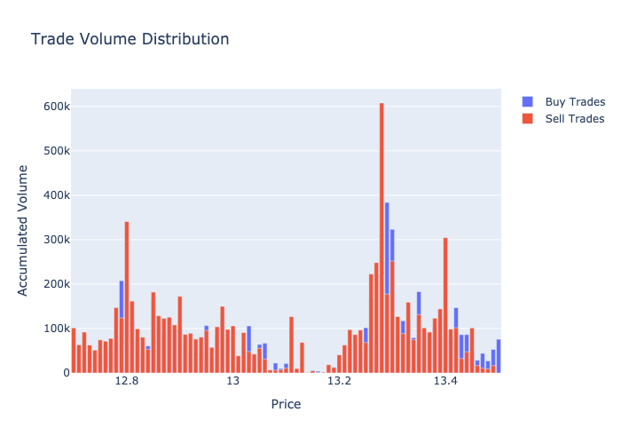
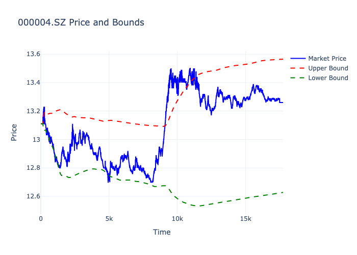

# Market Data Analysis and Backtesting Framework

This repository provides a framework for analyzing market data and performing backtesting using various custom-designed factors. The key components of this framework include market data loading, monitoring, and analysis, with support for visualizing results using Plotly.

## Task1 Load Market Data
- **api.py**: Defines the API for loading market data and adding market data monitors.

## Task2 Market Data Replay
- **utils.py**: Contains the `ProgressiveReplay` class for replaying market data.

## Task3 Descriptive Statistics
- **factor1.py**: Defines the `AggregatedTrade` class for monitoring and aggregating trade data.
- **backtest1.py**: Sets up a backtest using the `AggregatedTrade` monitor.

- 

## Task4 Factor Design
- **sampler.py**: Helper module for sampling data.
- **factordesign2.py**: Defines the `ChipDistribution` class for calculating and plotting chip distributions.
- **backtest factor design.py**: Sets up a backtest using the `ChipDistribution` monitor and calculates prediction power.
- 
